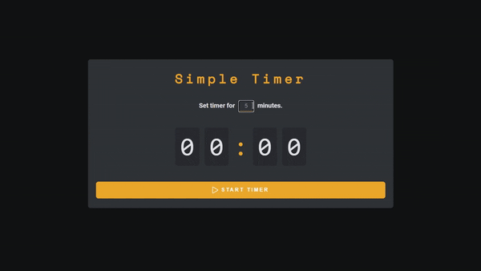

# Simple-Timer

### Project Description

The project is a simple timer that allows the user to set a time and start the countdown.

The interface consists of a form where the user can input the number of minutes for the timer, and a display that shows the remaining time in digits.

#### Demo: [Simple Timer](https://dmitrylasuta.github.io/simple-Timer/)

The timer is designed to be responsive and adapt to different screen sizes.

### Technologies Used

`JavaScript` for the timer logic and event handling.
`HTML` and `CSS` for creating the interface and styling.

### Code Description

- The `startTimer` function starts the timer and updates the display of the remaining time every _500_ milliseconds.
- The `setTimerValues` function updates the values of the digit blocks to display the remaining time.
- The `clearTimer` function stops the timer and resets the values of the digit blocks.
- The `submit` event handler on the form gets the user-inputted time, clears the timer, and starts a new timer with the specified time.
